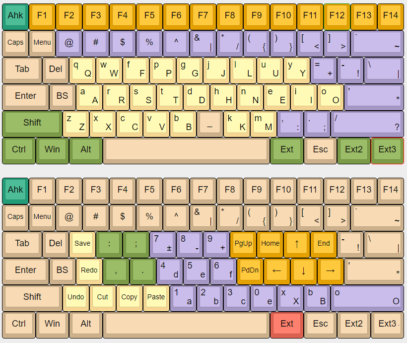

# AHK Script Creator

Simple-ish python library which generates AHK scripts for remapping your keyboard, with support for an extend layer.

### Example

Swapping `Backspace` with `CapsLock`:

```python
from script_creator import ScriptCreator

sc = ScriptCreator()
sc.add_key('Backspace', 'CapsLock')
sc.add_key('CapsLock', 'CapsLock')

with open('output.ahk', 'w') as file:
    file.write(sc.output())
```

For a more complex example, the following layout is achieved with `example_output.ahk`, which can be generated with `example.py`:

